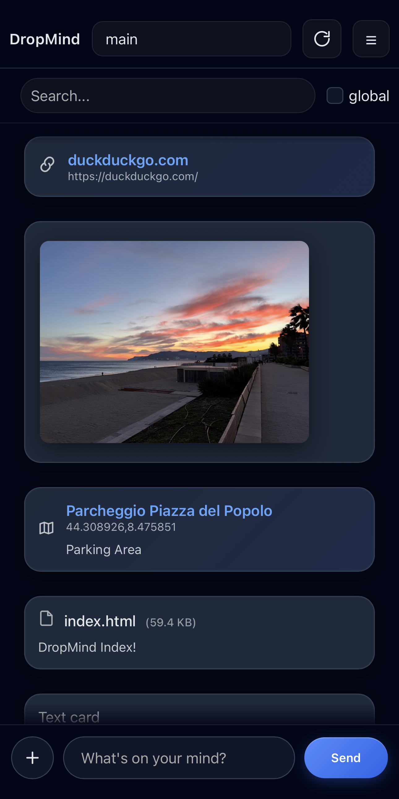

# DropMind

> If it lives in your head, it should live on your server.

DropMind is a self-hosted memory cache for your digital thoughts.

Save links, notes, files, images and locations in one place --- fully
under your control.

No cloud lock-in. No external accounts. Just your server.

------------------------------------------------------------------------

## ✨ Features

-   📌 Pin important messages
-   📎 File & image upload
-   🔗 Smart link cards
-   📍 Map / GPS location detection
-   🗂 Multiple clipboards
-   ⭐ Favorite clipboard
-   🔍 Local & global search
-   🌙 Clean dark UI
-   📱 Fully mobile responsive
-   🐳 Docker-ready backend

------------------------------------------------------------------------

## 📸 Interface Preview

### Desktop


### Mobile



------------------------------------------------------------------------

## 🧠 Philosophy

DropMind was born from a simple idea:

Your thoughts are personal.\
Your memory system should be too.

This is not a cloud service.\
It is a self-hosted digital extension of your mind.

------------------------------------------------------------------------

## 👤 Human + AI Development

DropMind was conceived, designed and architected by a human.

The implementation was developed with the support of AI tools, under
direct human supervision and decision-making.

Every architectural choice, feature direction and philosophy belongs to
the project author.

This project embraces AI as a tool --- not as an autonomous creator.

------------------------------------------------------------------------

## 🏗 Architecture

-   Backend: FastAPI\
-   Database: SQLite\
-   Frontend: Vanilla HTML / CSS / JS\
-   Containerized: Docker

Designed to be lightweight, portable and easy to deploy on:

-   Raspberry Pi
-   Home server
-   VPS
-   NAS

------------------------------------------------------------------------

## 🚀 Installation (Docker)

``` bash
git clone https://github.com/oldany/dropmind.git
cd dropmind
docker compose up -d
```

Then open:

    http://localhost:8000

------------------------------------------------------------------------

## ⚙ Configuration

Create a `config.js` file in the frontend root:

``` js
window.DM_CONFIG = {
  API_TOKEN: "your-secure-token"
};
```

Set the same token in backend environment variables.

------------------------------------------------------------------------

## 🍎 iOS / iPadOS Shortcut

DropMind integrates with Apple Shortcuts for a seamless mobile workflow.

Using the official Shortcut, you can:

- Share links directly from Safari  
- Save selected text from any app  
- Upload images to DropMind
- Upload files from any app that support share menu
- Send content to a specific clipboard ( 1 is the default main )

### Install the Shortcut

👉 **Download here:**  
[Add DropMind Shortcut](https://www.icloud.com/shortcuts/8f39d178512145918c7d1fda03d31c43)

After installation:

1. Open the Shortcut once to grant permissions  
2. Set your DropMind server URL  
3. Insert your API token  
4. Choose your default clipboard  

You're ready.

Fully local. Fully yours.

------------------------------------------------------------------------

## Why AGPL?

To ensure that DropMind remains open if modified and offered as a public
service.

------------------------------------------------------------------------

## 📜 License

DropMind is licensed under the GNU Affero General Public License v3.0
(AGPL-3.0).

You are free to use, modify and self-host it.

If you modify DropMind and deploy it publicly, you must release your
changes under the same license.

------------------------------------------------------------------------

## 🌊 Drop it. Own it. Move on.
